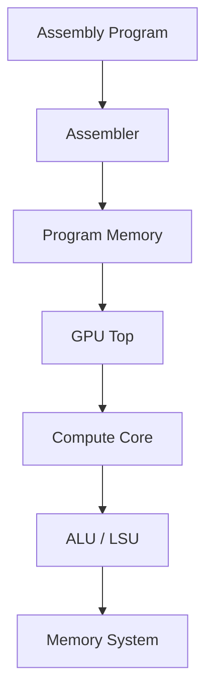

# <div align="center">  Tiny GPU Architecture </div>

<div align="center"> 

    

</div> 

> [!IMPORTANT]
> Tiny GPU is an educational SIMT-inspired GPU architecture implemented in SystemVerilog.
>
> The project provides a complete execution flow consisting of an assembler, executable RTL, memory subsystem, integration environment, and automated verification infrastructure.

---
# Overview

Tiny GPU is a lightweight GPU-style execution platform intended for experimentation with:

* GPU architecture
* SIMT execution models
* RTL design
* Verification methodologies
* Hardware/software co-design

The design currently supports:

* Multi-core execution
* Multi-thread execution per core
* Arithmetic operations
* Memory operations
* Conditional branching
* External memory interfaces
* Program execution from assembled binaries

---

# Design Goals

## Current Goals

* [x] End-to-end executable flow
* [x] External memory interface
* [x] Multi-core integration
* [x] Thread-aware execution
* [x] Assembly toolchain
* [x] Automated verification

## Future Goals

* [ ] Warp switching
* [ ] Occupancy management
* [ ] SIMD execution
* [ ] Cache hierarchy
* [ ] Scoreboarding
* [ ] FPGA deployment
* [ ] Coverage-driven verification

---

# Top-Level Architecture

```text
                    +----------------------+
                    | Device Control Reg   |
                    +----------+-----------+
                               |
                               v

+------------------------------------------------------+
|                      GPU TOP                         |
|                                                      |
|  +----------------+     +------------------------+   |
|  | Block Dispatch |     | Memory Controllers     |   |
|  +-------+--------+     +-----------+------------+   |
|          |                          |                |
|          v                          v                |
|                                                      |
|  +---------------+    +---------------+             |
|  |    Core 0     |    |    Core 1     |             |
|  +---------------+    +---------------+             |
|                                                      |
+------------------------------------------------------+
```

---

# Module Hierarchy

```text
gpu_top
│
├── dcr
├── block_dispatch
├── data_memory_controller
├── program_memory_controller
│
└── cores[]
    │
    └── core
        │
        ├── fetch
        ├── decode
        ├── scheduler
        ├── register_file
        ├── alu
        ├── lsu
        └── pc
```

---

# Execution Flow



---

# GPU Top

The `gpu_top` module serves as the integration point for the entire design.

Responsibilities:

| Responsibility      | Description                        |
| ------------------- | ---------------------------------- |
| Core Integration    | Instantiates compute cores         |
| Dispatch            | Launches blocks on available cores |
| Memory Routing      | Connects cores to external memory  |
| Configuration       | Receives runtime parameters        |
| Completion Tracking | Detects kernel completion          |

---

## Key Parameters

| Parameter             | Description                      |
| --------------------- | -------------------------------- |
| NUM_CORES             | Number of compute cores          |
| THREADS_PER_BLOCK     | Threads supported per core       |
| DATA_MEM_ADDR_BITS    | Data memory address width        |
| DATA_MEM_DATA_BITS    | Data memory data width           |
| PROGRAM_MEM_ADDR_BITS | Program memory address width     |
| PROGRAM_MEM_DATA_BITS | Program memory instruction width |

---

# Memory Subsystem

The memory subsystem consists of two independent controllers.

## Program Memory Controller

Purpose:

* Instruction fetch arbitration
* Instruction response routing

Characteristics:

* Read-only
* Shared across all cores
* Supports configurable fetch channels

---

## Data Memory Controller

Purpose:

* Load request routing
* Store request routing
* Arbitration between LSU clients

Characteristics:

* Shared memory fabric
* Multi-channel support
* Concurrent memory transactions

---

# Device Control Register

The Device Control Register (DCR) stores runtime configuration.

Current functionality:

| Field        | Description                        |
| ------------ | ---------------------------------- |
| Thread Count | Number of active execution threads |

The DCR is configured before kernel launch.

---

# Block Dispatch

The Block Dispatcher manages GPU execution at the kernel level.

Responsibilities:

* Core allocation
* Block assignment
* Start control
* Completion tracking

Current implementation provides:

* Static dispatch
* Core activation
* Completion aggregation

---

# Compute Core

The compute core is the primary execution engine.

Each core contains:

| Module        | Responsibility        |
| ------------- | --------------------- |
| Fetch         | Instruction retrieval |
| Decode        | Instruction decoding  |
| Scheduler     | Pipeline control      |
| Register File | Architectural state   |
| ALU           | Arithmetic execution  |
| LSU           | Memory execution      |
| PC            | Program flow control  |

---

# Execution Pipeline

The scheduler controls instruction execution using a state-machine pipeline.


---

## FETCH

Responsibilities:

* Generate instruction fetch requests
* Update instruction buffer

---

## DECODE

Responsibilities:

* Decode opcode
* Generate control signals
* Select execution resources

---

## REQUEST

Responsibilities:

* Read source operands
* Generate memory requests

---

## WAIT

Responsibilities:

* Wait for memory completion
* Synchronize execution resources

---

## EXECUTE

Responsibilities:

* ALU execution
* LSU execution

---

## UPDATE

Responsibilities:

* Register writeback
* Program counter update
* Architectural state update

> [!NOTE]
> Register file writeback occurs during the UPDATE stage.

---

# Arithmetic Logic Unit

Currently implemented operations:

| Instruction | Description    |
| ----------- | -------------- |
| CMP         | Compare        |
| ADD         | Addition       |
| SUB         | Subtraction    |
| MUL         | Multiplication |
| DIV         | Division       |

Future planned operations:

* AND
* OR
* XOR
* NOT
* SHL
* SHR

---

# Register File

Each execution thread contains a dedicated register file.

Responsibilities:

* Source operand storage
* Destination register updates
* Thread-local architectural state

Special registers:

| Register | Purpose           |
| -------- | ----------------- |
| R13      | Block ID          |
| R14      | Threads Per Block |
| R15      | Thread ID         |

---

# Program Counter

The PC module manages instruction sequencing.

Responsibilities:

* Sequential execution
* Branch handling
* NZP flag tracking

Supported branch conditions:

| Condition | Description |
| --------- | ----------- |
| N         | Negative    |
| Z         | Zero        |
| P         | Positive    |

---

# Load Store Unit

The LSU manages all memory accesses.

Supported operations:

| Operation | Description      |
| --------- | ---------------- |
| LOAD      | Read from memory |
| STORE     | Write to memory  |

The LSU communicates with the Data Memory Controller through request/response channels.

---

# Verification Status

| Area                 | Status     |
| -------------------- | ---------- |
| ALU                  | ✅ Verified |
| Decoder              | ✅ Verified |
| Core Execution       | ✅ Verified |
| Program Execution    | ✅ Verified |
| GPU Top Integration  | ✅ Verified |
| Memory Interfaces    | ✅ Verified |
| Branch Execution     | ✅ Verified |
| Load/Store Execution | ✅ Verified |

---

# Design Assumptions

> [!IMPORTANT]
> Tiny GPU currently assumes:
>
> * Programs are preloaded into program memory
> * Data is preloaded into data memory
> * Device control registers are configured before launch
> * Memory behaves as an external asynchronous resource

---

# Current Limitations

> [!WARNING]
> The current implementation is an early architectural prototype.

Not yet implemented:

* Warp switching
* Occupancy management
* Cache hierarchy
* Architectural scoreboarding
* SIMD execution
* Floating-point execution
* FPGA timing closure

---

# Future Architecture Roadmap

## v0.2.0

* [ ] Logic instructions
* [ ] Shift instructions
* [ ] Assembler labels

## v0.3.0

* [ ] Architectural scoreboarding
* [ ] Vector workloads
* [ ] Enhanced verification

## v0.4.0

* [ ] Warp scheduling improvements
* [ ] Occupancy tracking

## v0.5.0

* [ ] FPGA deployment
* [ ] Performance characterization

---

<div align="center">

# Version Information

| Item         | Value         |
| ------------ | ------------- |
| Project      | Tiny GPU      |
| Version      | v0.1.0-alpha  |
| Language     | SystemVerilog |
| Verification | Cocotb        |
| Simulator    | Verilator     |

---
*Last Updated: June 2026*

</div>
